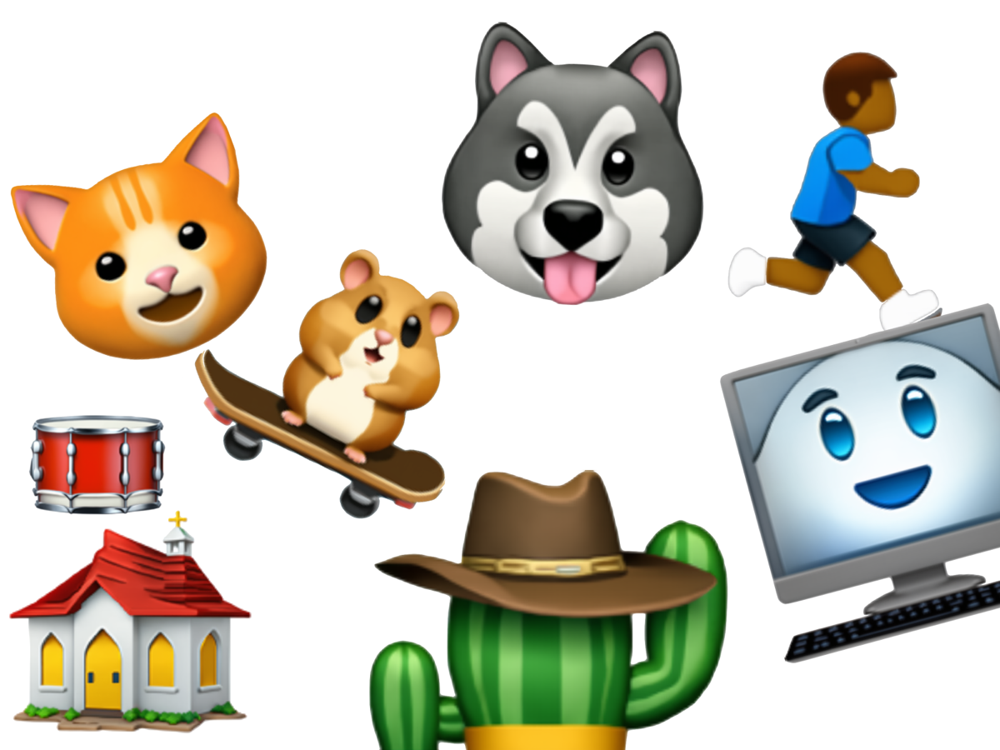

# Emoji Gen 🥳

[](assets/thumbnail.png)

A project for generating custom emojis (like these above) using fine-tuned open source diffusion models. Additionally provides CLIs for both dev and generation. I completely broke this project and abandoned it after the class was over, but while it was running it was awesome. Read the below poster and report for more info.

## 📚 Project Documentation

- **[Project Poster](assets/poster.pdf)** - 1 page overview
- **[Technical Report](assets/report.pdf)** - Paper on results and process

## 🚨 This project is not fully complete 🚨

- RAG System: Partially implemented but needs refinement, not actually used in generation yet
- LLM Integration: Very basic implementation exists but could be improved
- Error Handling: Some edge cases not fully handled
- Testing: No testing lol
- Model Validation: Fine-tuned models need validation pipeline, often drift
- Performance Optimization: Memory management and GPU optimization very poor
- Lot of VM specific issues

## Features

- Text-to-Emoji Generation: Convert text descriptions to custom emoji images
- Multiple Model Support: SD 1.5, SDXL, and SD3 Medium
- Fine-tuning Pipeline: DreamBooth implementation for custom emoji training
- RAG/LLM Enhancement: Enhance prompts with LLMs and (kind of) RAG
- Server Mode: Fast consecutive generation via Flask server
- Benchmark Mode: Test generation quality across multiple prompts

## Installation (probably will not work, project abandoned)

**Setup:**

1. **Clone the repository:**

   ```bash
   git clone https://github.com/phunt22/emoji-gen.git
   cd emoji-gen
   ```

2. **Create and activate a virtual environment:**

   ```bash
   python -m venv venv
   source venv/bin/activate
   ```

3. **Install the package in development mode:**
   ```bash
   pip install -e .
   ```

## GCP Setup and Management

**Note: This project is designed to run on GCP VMs with GPU support.**

**VM Setup:**

Follow these instructions to set up your GCP VM:
https://rayxsong.github.io/research/2024/WI/Nera/Nera-Weekly-Update-1

**Important Notes:**

- T4 GPUs are hard to get (consider L4 or other alternatives)
- Spot instances are much cheaper and work well for this project
- **Always stop VMs when not in use to avoid charges (I may or may not have had a learning moment)**

**GCP Configuration:**

1. **Initialize gcloud:**

   ```bash
   gcloud init
   # Choose option 1 to re-initialize
   # Log into your GCP account
   # Select your project
   ```

2. **Verify configuration:**

   ```bash
   gcloud config list
   ```

3. **VM Management:**

   ```bash
   # List all compute instances
   gcloud compute instances list
   # RUNNING = being charged, TERMINATED = not being charged

   # Stop a VM instance (IMPORTANT: stops billing)
   gcloud compute instances stop instance-[INSTANCE_NAME]

   # Start a VM instance
   gcloud compute instances start instance-[INSTANCE_NAME]
   ```

4. **Environment Setup:**
   Create a `.env` file in the project root on your local computer:

   ```bash
   # Get these from your GCP VM
   GCP_VM_EXTERNAL_IP=your_vm_ip
   GCP_INSTANCE_NAME=your_instance_name

   # Local directory for syncing generated emojis
   EMOJI_LOCAL_SYNC_DIR=/path/to/local/sync/dir
   ```

## Usage

**Note: Python virtual environment must be activated**

**User CLI (`emoji-gen`):**

Generate custom emojis with text prompts:

```bash
# Basic usage
emoji-gen "cat with sunglasses"

# Advanced options
emoji-gen "happy face with sunglasses" --steps 30 --guidance 8.0

# Benchmark mode (runs multiple prompts)
emoji-gen --benchmark

# Custom benchmark output folder
emoji-gen --benchmark --name my_test_run

# Benchmark prompts are stored in `emoji_gen/benchmarks/prompts.txt`
# Output goes to `generated_emojis/benchmark_[timestamp]/` by default

# Use RAG enhancement
emoji-gen "pizza slice" --rag

# Use LLM prompt augmentation
emoji-gen "happy robot" --llm
```

**Parameters:**

- `--steps`: Number of inference steps (default: 25)
- `--guidance`: Guidance scale (default: 7.5)
- `--output`: Custom output directory
- `--rag`: Enable RAG enhancement
- `--llm`: Enable LLM prompt augmentation
- `--local`: Force local generation (bypass server)

**Developer CLI (`emoji-dev`):**

Manage models and fine-tuning:

```bash
# List available models
emoji-dev list-models

# Set active model
emoji-dev set-model sd3

# Start inference server
emoji-dev start-server --model sd3

# Prepare emoji dataset for training
emoji-dev prepare

# Fine-tune a model
emoji-dev fine-tune --model sd3 --output-name my_emoji_model

# List fine-tuned models
emoji-dev list-fine-tuned

# Sync generated images from VM to local machine
emoji-dev sync
```

**Important Note on `set-model`:**
The `emoji-dev set-model [MODEL]` command can encounter memory issues on GPU. It's more reliable to start/restart the server with the desired model:

```bash
emoji-dev start-server --model [MODEL]
```

**Fine-tuning Parameters:**

Key flags for `fine-tune` include:

- `--model`: Base model ID or path (default: from `config.py`)
- `--max-train-steps`: Training steps (default: 500)
- `--batch-size`: Batch size (default: 1)
- `--learning-rate`: Learning rate (default: 1e-4)
- `--lora-rank`: LoRA rank (default: 32)

For complete parameter documentation, see the [Stable Diffusion fine-tuning guide](https://github.com/huggingface/diffusers/blob/main/examples/dreambooth/README_sdxl.md).

**Available Models:**

Base models are defined in `emoji_gen/config.py`:

```python
MODEL_ID_MAP = {
    "sd3": "stabilityai/stable-diffusion-3-medium-diffusers",
    "sd3-ipadapter": "stabilityai/stable-diffusion-3.5-large",
    "SD-XL": "stabilityai/stable-diffusion-xl-base-1.0",
    "sd-xl": "stabilityai/stable-diffusion-xl-base-1.0",
}
```

It should be fairly easy to add more, if they are compatible.

Fine-tuned models are stored in the `fine_tuned_models` directory and are automatically detected by the system.

## VSCode Settings:

If you think they're annoying (like I do) these to your VSCode `files.exclude`:

- `"**/__pycache__**"`
- `"**/*.egg_info"`

## Acknowledgments

- **Stable Diffusion Team** - Base models and fine-tuning techniques
- **Evan Zhou** - Inspiration from his project, open-genmoji
- **Hugging Face** - Diffusers library and model hosting
